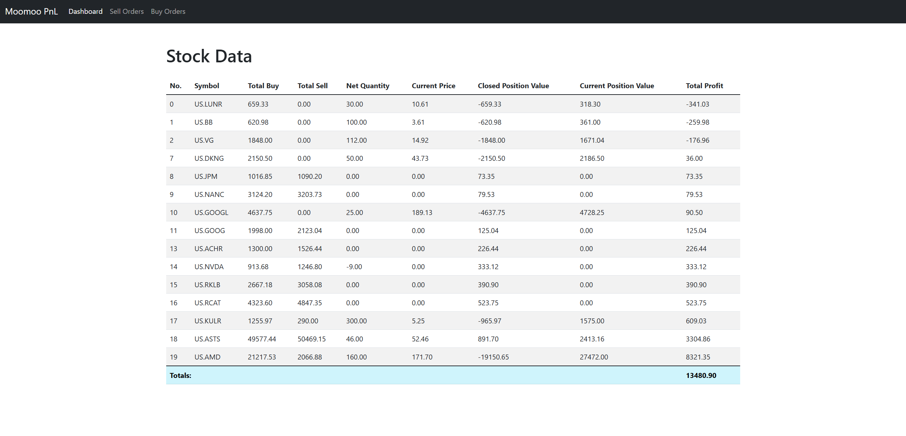
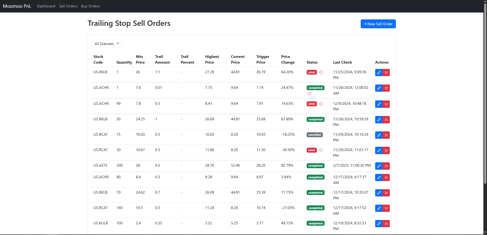
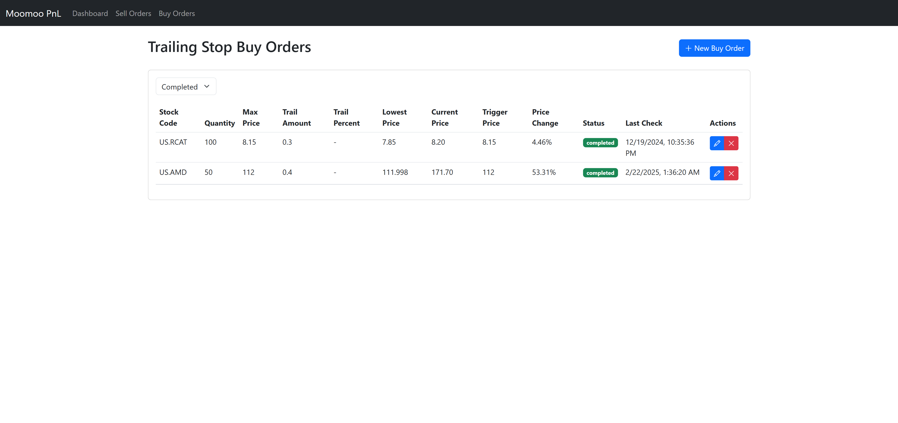
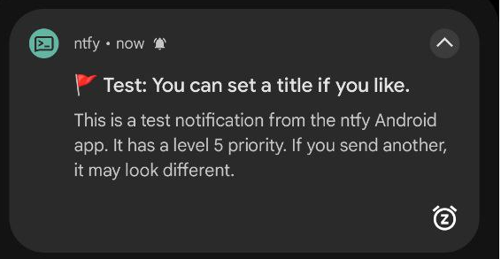

# Moomoo P&L Dashboard (MPNL)

Moomoo P&L Dashboard is a simple website to view your overall Profit and Loss for securities, execute custom orders (both sell & buy orders) and providing alerting based on custom metrics.

This was created to supplement the Moomoo app's functionality.

Some of the errors I faced were:

1. There is no way to track your total Profit and Loss for securities which you have no position in (i.e. you have completely sold all shares of that stock.)

1. The total P&L shown on your Moomoo's accounts page also changes wildly when you add or remove funds from your account, and is not really reflective of your true P&L.

1. Some of the order types that I would want are not supported, such as a trailing-stop order with a minimum amount.

## Features

### Page showing overall profit/loss per stock ticker



### Sell page with custom sell order types




### Buy page with custom buy order types



### Notifications for custom alerts

Set up custom alerts to send push notifications to your phone via ntfy.sh. Some examples are for when the USD exchange rate changes, when the price of bitcoin changes, when there is news about your stock, etc.




# Setup

We require the Moomoo OpenD client to interface with Moomoo (the Moomoo docs state that the API is not sufficient). It can be downloaded here (select OpenD client) for your operation system. 

https://www.moomoo.com/download/OpenAPI

<br/>

This project uses `uv` to manage python dependencies.

```bash
uv run python -m src.main
```

## Contributing

Pull requests are welcome. For major changes, please open an issue first
to discuss what you would like to change.

Please make sure to update tests as appropriate.

## License

[MIT](https://choosealicense.com/licenses/mit/)
